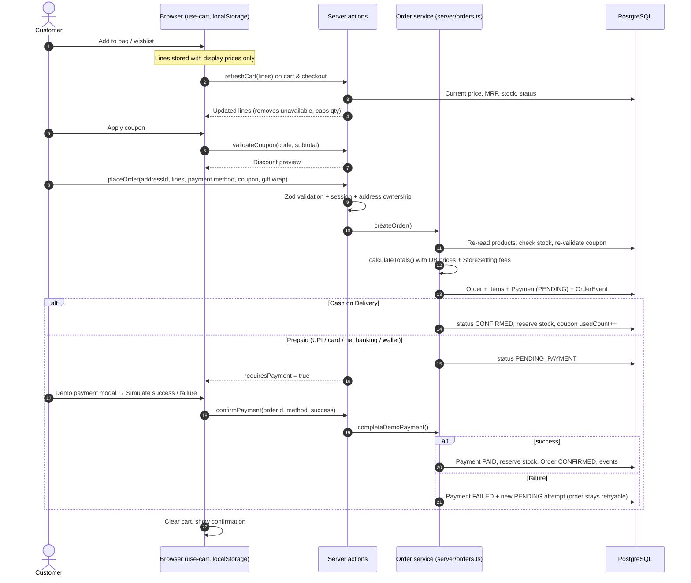
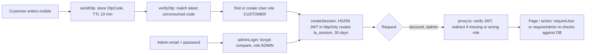
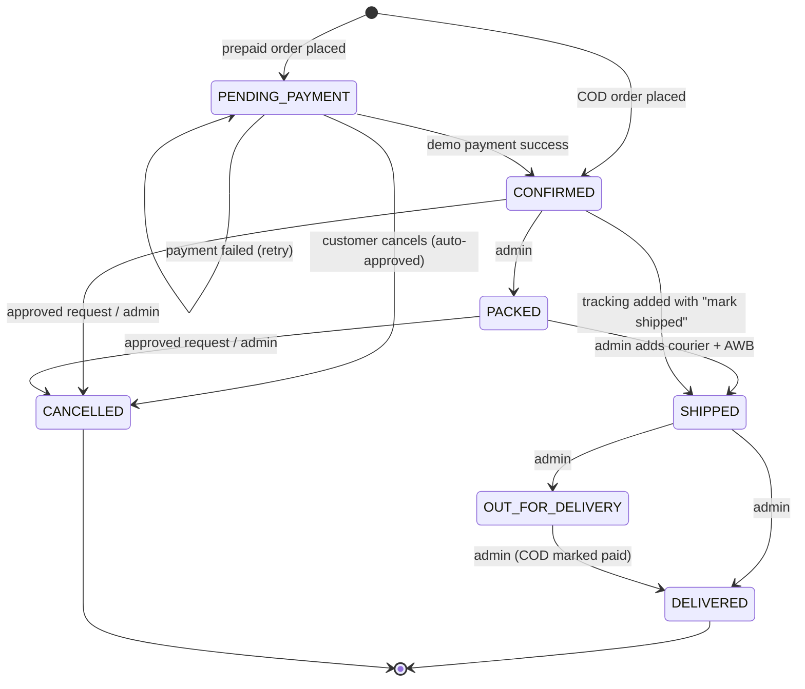
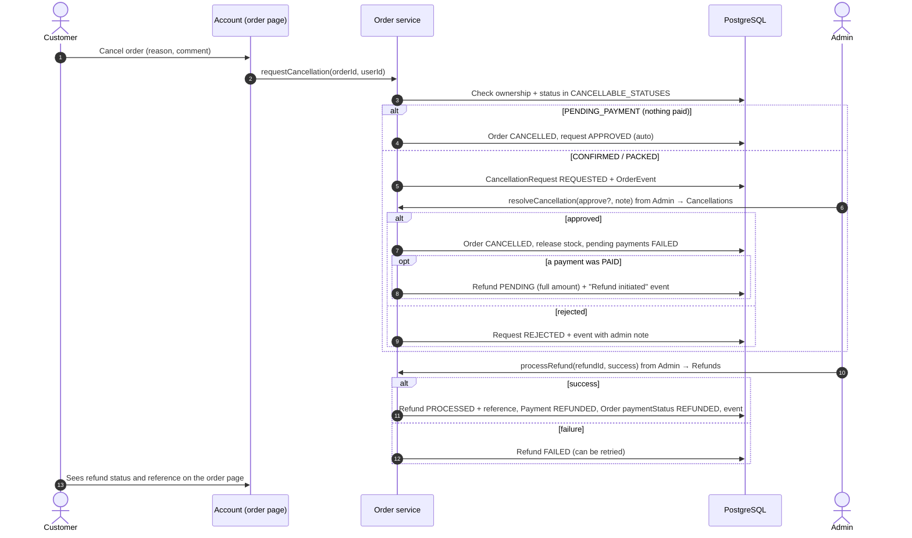

# Architecture

This document explains how LushAura is put together: how pages render, where data flows, how auth and orders work,
and what must change before the demo becomes a production store.

- [1. Rendering model](#1-rendering-model)
- [2. Folder structure](#2-folder-structure)
- [3. Cart → checkout → order → payment](#3-cart--checkout--order--payment)
- [4. Authentication & authorisation](#4-authentication--authorisation)
- [5. Order state machine](#5-order-state-machine)
- [6. Cancellation & refund flow](#6-cancellation--refund-flow)
- [7. Image storage](#7-image-storage)
- [8. SEO](#8-seo)
- [9. Security notes](#9-security-notes)
- [10. Demo-only vs production-ready](#10-demo-only-vs-production-ready)
- [11. Going to production](#11-going-to-production)

---

## 1. Rendering model

LushAura uses the **Next.js 16 App Router** with React Server Components as the default.

| Layer | Runs on | Used for |
| --- | --- | --- |
| **Server Components** (default) | Server | Every page and layout. Read the database directly through `src/server/*` (e.g. `getProducts`, `getStoreSettings`, `getOrderForUser`). No client JS unless needed. |
| **Server Actions** (`src/server/actions/*`, `"use server"`) | Server | All mutations — login, place order, confirm payment, cancel, admin updates, contact form. Validate with Zod, check the session, return `ActionResult`, then `revalidatePath()`. |
| **Client islands** (`"use client"`) | Browser | Interactive pieces only: cart/wishlist store, search autocomplete, filter drawer, checkout steps, payment modal, dialogs, forms, admin charts. |
| **Route handlers** (`src/app/api/*`, `src/app/uploads/*`) | Server | Non-form endpoints: search suggestions (JSON), admin image upload (multipart), orders CSV export, serving uploaded files. |
| **`src/proxy.ts`** (formerly middleware) | Before routing | Optimistic redirect for `/account/*` and `/admin/*` when the session cookie is missing or not an admin. |

Other rendering notes:

- Pages that read the database are **dynamic** (Cache Components is not enabled). After a mutation, actions call
  `revalidatePath()` for the affected routes so the next navigation shows fresh data.
- `loading.tsx` files provide skeletons while server components stream; `error.tsx` / `global-error.tsx` catch
  unexpected errors; `not-found.tsx` renders the branded 404.
- The root layout loads store settings and the current user once and passes a serialisable subset to
  `StoreProvider`, so client components can use `useStoreSettings()` / `useCurrentUser()` without extra requests.
- Money is whole rupees (`Int`), GST-inclusive, formatted with `formatINR()`.

## 2. Folder structure

```
src/
  app/
    layout.tsx            root: fonts, metadata, StoreProvider, Toaster
    (store)/              storefront (announcement bar + header + footer)
      page.tsx, shop/, gifts/, cosmetics/, category/[slug]/, product/[slug]/, search/, wishlist/, cart/,
      checkout/, login/, account/…, track/, about/, contact/, faq/, shipping-policy/, returns/, privacy/, terms/
    admin/login/          admin sign-in (no panel chrome)
    admin/(panel)/        admin (sidebar layout; layout calls requireAdmin())
    invoice/[orderNumber] printable GST invoice without store chrome
    api/                  search, admin/upload, admin/orders/export
    uploads/[...path]     serves files from UPLOAD_DIR
    sitemap.ts, robots.ts, opengraph-image.tsx, icon.svg, not-found.tsx, error.tsx, global-error.tsx
  components/             ui/ (Base UI primitives), layout/, common/, product/, catalog/, cart/, checkout/,
                          account/, admin/, content/, providers/
  config/                 site.ts (brand, nav, demo credentials), media.ts (marketing images)
  hooks/use-cart.ts       cart + wishlist store (useSyncExternalStore + localStorage)
  lib/                    db (Prisma client), auth (session + guards), pricing, format, validators, order-status
  server/                 server-only domain logic
    catalog.ts            storefront read queries (ACTIVE products only)
    orders.ts             order service — the ONLY place that changes Order.status
    settings.ts           StoreSetting row with defaults
    storage.ts            upload storage abstraction
    admin/                admin list/detail queries and schemas
    actions/              server actions, one file per domain
  generated/prisma/       generated Prisma client (do not edit)
  proxy.ts                optimistic route guard
prisma/                   schema, migrations, seed
```

## 3. Cart → checkout → order → payment



Key rules:

- **The client is never trusted for money.** The browser cart is a convenience; `createOrder()` recomputes every
  total from database prices using the same pure `calculateTotals()` function the UI uses for display.
- Stock is **reserved** (decremented) when an order becomes CONFIRMED and **released** if a confirmed order is
  cancelled. Unpaid orders don't hold stock.
- Coupon `usedCount` increments only when an order is confirmed (COD) or paid (prepaid).
- Order numbers look like `LA2609264821` (`LA` + `YYMMDD` + 4 random digits).
- Payment records are append-only attempts: a failed attempt stays in the ledger, and a fresh PENDING attempt is
  created for the retry.

## 4. Authentication & authorisation



- **Customer login is mock OTP**: `sendOtp()` stores a code (always `123456` in demo) in `OtpCode`; `deliverOtp()` is a
  no-op where an SMS provider would plug in. `verifyOtp()` consumes the code and creates the user on first login.
- **Admin login** uses email + bcrypt-hashed password (`User.passwordHash`, `role = ADMIN`). Admin accounts can't use
  OTP login.
- **Session**: a signed JWT (`jose`, HS256, `SESSION_SECRET`) in the `la_session` httpOnly cookie, valid 30 days.
  Payload: `userId`, `role`, `name`. Customer and admin share the one cookie, so signing in as one signs out the other.
- **Two layers of protection**:
  1. `src/proxy.ts` — *optimistic* and cheap: redirects `/account/*` to `/login?next=…` and `/admin/*` to
     `/admin/login` if the cookie is missing/invalid or not an admin. It never touches the database.
  2. `requireUser(returnTo)` / `requireAdmin()` from `@/lib/auth` — *authoritative*: every protected page, layout,
     server action and route handler loads the user from the database and checks the role. Customer actions also
     check ownership (`userId`) of orders and addresses.

## 5. Order state machine

All transitions go through `src/server/orders.ts`; allowed admin moves are defined in `NEXT_STATUSES`
(`src/lib/order-status.ts`).



| Status | Meaning | Stock | Customer can cancel? |
| --- | --- | --- | --- |
| `PENDING_PAYMENT` | Prepaid order awaiting payment | not reserved | Yes — instantly |
| `CONFIRMED` | Paid, or COD accepted | reserved | Yes — request, admin approves |
| `PACKED` | Gift-packed, ready to ship | reserved | Yes — request, admin approves |
| `SHIPPED` | Handed to courier (courier + AWB set) | reserved | No |
| `OUT_FOR_DELIVERY` | With the delivery agent | reserved | No |
| `DELIVERED` | Delivered (COD payment marked PAID) | — | No (returns policy applies) |
| `CANCELLED` | Cancelled; stock released; refund queued if paid | released | — |

Every transition writes an `OrderEvent` (title, note, optional location) which powers the customer timeline, the
`/track` page and the admin timeline. Tracking scans (`addTrackingEvent`) add events without changing status.

## 6. Cancellation & refund flow



Admins can also cancel directly (CONFIRMED/PACKED → CANCELLED via status update), which runs the same
`cancelOrderTx` (restock + refund if paid). COD orders have nothing to refund until delivered.

## 7. Image storage

- **Marketing images** (hero, banners, category tiles) are static config in `src/config/media.ts`.
- **Product images** are uploaded by admins through `POST /api/admin/upload` (multipart field `file`, admin-only,
  ≤ 5 MB, JPG/PNG/WebP/AVIF verified by magic bytes). The handler calls `saveUpload()` in `src/server/storage.ts`,
  which writes to `UPLOAD_DIR/products/<random key>.<ext>` and returns a URL like `/uploads/products/…`. That URL is
  stored in `ProductImage.url`.
- `GET /uploads/[...path]` streams the file with a one-year immutable cache header (keys are random, so files never
  change). Path traversal is rejected.
- **The abstraction**: callers only ever handle the returned URL. To move to S3, Cloudinary or R2, reimplement
  `saveUpload` / `readUpload` / `deleteUpload` in `storage.ts` and add the CDN host to `next.config.ts`
  `images.remotePatterns`. Nothing else changes.
- `<ProductImage>` renders a branded placeholder when a product has no image (seeded products start without photos).

## 8. SEO

| Feature | Where |
| --- | --- |
| Default title template, description, Open Graph, Twitter card, `metadataBase` | `src/app/layout.tsx` |
| Per-page `metadata` / `generateMetadata` (title, description, canonical) | each `page.tsx`; product pages use `metaTitle` / `metaDescription` when set |
| `sitemap.xml` — static routes + every ACTIVE product and every category, with `lastModified` | `src/app/sitemap.ts` (revalidates hourly; falls back to static routes if the DB is unreachable) |
| `robots.txt` — allow all, disallow `/admin`, `/account`, `/checkout`, `/cart`, `/api`, `/invoice`, `/login` | `src/app/robots.ts` |
| Open Graph image (1200×630) and favicon | `src/app/opengraph-image.tsx`, `src/app/icon.svg` |
| JSON-LD **Product** (price, availability, rating) | `src/components/catalog/product/product-json-ld.ts` |
| JSON-LD **BreadcrumbList** | `src/components/common/breadcrumbs.tsx` (every page that shows breadcrumbs) |
| JSON-LD **FAQPage** | `src/app/(store)/faq/page.tsx` |
| JSON-LD **Organization** | home page (`src/app/(store)/page.tsx`) |
| `noindex` for invoices and 404 pages | page metadata |

`NEXT_PUBLIC_SITE_URL` must be set to the real domain in production so canonical URLs and the sitemap are correct.

## 9. Security notes

- **Server-side truth**: prices, discounts, fees, stock and order status are always computed on the server.
- **Input validation**: every action parses input with Zod; errors are returned as `ActionResult` (never thrown to
  the client with internals). Phone numbers, PIN codes and emails have dedicated schemas.
- **Authorisation**: `requireAdmin()` is the first line of every admin action; customer actions check `userId`
  ownership; route handlers check the role themselves (`/api/admin/*`).
- **Sessions**: httpOnly, signed with `SESSION_SECRET` (the app throws in production without it).
- **CSRF**: Server Actions are POST-only and Next.js checks the `Origin` header against the host.
- **Uploads**: size limit, type sniffing, random keys, `X-Content-Type-Options: nosniff`, no user-controlled paths.
- **CSV export** neutralises spreadsheet formula injection.
- **XSS**: React escapes output; JSON-LD is serialised with `JSON.stringify` from server data only.
- **Payments**: the demo never receives card/UPI data — only the chosen method and the simulated outcome.
- Known demo gaps (fix before go-live): no rate limiting on OTP/login/contact, no session revocation, fixed OTP.

## 10. Demo-only vs production-ready

| Area | Status | Notes |
| --- | --- | --- |
| Pricing engine, coupons, fees, GST display | ✅ Production-ready | Pure functions shared by client and server |
| Order service & state machine, stock reservation, cancellations, refund bookkeeping | ✅ Production-ready | Transactions, event timeline |
| Catalogue, search, filters, SEO | ✅ Production-ready | Consider Postgres full-text search at scale |
| Admin panel CRUD, moderation, settings | ✅ Production-ready | Single admin role; add staff roles if needed |
| Customer OTP login | ⚠️ Demo | Fixed OTP `123456`, no SMS, no rate limit |
| Payments | ⚠️ Demo | Simulated gateway, no Razorpay integration or webhooks |
| Refund processing | ⚠️ Demo | Marks refunds processed with a fake reference; no gateway refund API call |
| Image storage | ⚠️ Local disk | Needs cloud storage on serverless hosts |
| Notifications (email / SMS / WhatsApp) | ❌ Not built | Order confirmation, shipping, refund updates |
| Invoice numbering | ⚠️ Demo | Derived from the order number; GST law needs a sequential, per-financial-year series |
| Courier integration | ⚠️ Manual | Admin types courier + AWB; no Shiprocket/Delhivery API |

## 11. Going to production

- [ ] **SMS OTP**: implement `deliverOtp()` in `src/server/actions/auth.ts` with MSG91 / Twilio / Gupshup (DLT-registered
      sender ID and template for India), generate random 6-digit codes, hash them at rest, limit attempts (e.g. 5)
      and resends (e.g. 3 per 10 minutes per number and per IP).
- [ ] **Razorpay**:
  1. Create a Razorpay order server-side in `placeOrder()` (amount in paise = `total × 100`) and store its id on the `Payment` row.
  2. Open Razorpay Checkout on the client with that order id instead of the demo modal.
  3. On the success callback, verify `razorpay_signature` = HMAC-SHA256(`order_id|payment_id`, key secret) on the server before marking the payment PAID (rename `completeDemoPayment()` to `completePayment()`).
  4. Add a webhook route (`/api/webhooks/razorpay`) that verifies `X-Razorpay-Signature` against the raw body with the webhook secret, and handles `payment.captured`, `payment.failed` and `refund.processed` idempotently.
  5. Call the Razorpay Refunds API from `processRefund()` and mark the refund PROCESSED only when the webhook confirms it.
  6. Expire unpaid `PENDING_PAYMENT` orders after ~30 minutes with a scheduled job.
- [ ] **Uploads**: switch `src/server/storage.ts` to S3 / Cloudinary / Cloudflare R2; serve through a CDN.
- [ ] **Notifications**: transactional email (Resend / SES / Postmark) and SMS/WhatsApp for order placed, shipped, out
      for delivery, delivered, cancellation decision and refund processed; alert support on new contact messages.
- [ ] **GST invoices**: sequential invoice numbers per financial year (e.g. `LA/2026-27/000123`) in a dedicated table,
      HSN-wise tax split (CGST + SGST within Karnataka, IGST inter-state) and PDF generation/storage.
- [ ] **Rate limiting & abuse**: OTP, login, contact form, reviews, search API (e.g. Upstash Ratelimit / Redis); bot
      protection (Cloudflare Turnstile) on public forms.
- [ ] **Sessions**: shorter admin sessions, optional server-side session table for revocation, 2FA for admins.
- [ ] **Hosting**: Vercel (or any Node host) + managed Postgres (Neon / Supabase / RDS) with connection pooling;
      set `NEXT_PUBLIC_SITE_URL`, `SESSION_SECRET`, `DATABASE_URL`; run `prisma migrate deploy` in CI.
- [ ] **Backups & monitoring**: automated daily Postgres backups with point-in-time recovery, error tracking (Sentry),
      uptime checks, structured logs.
- [ ] **Compliance**: legal pages reviewed by counsel, cookie consent if non-essential trackers are added, DPDP consent
      records and data-erasure workflow, Legal Metrology details on every product.
- [ ] **Remove demo credentials** and `DemoNotice` banners; change the seeded admin password.
