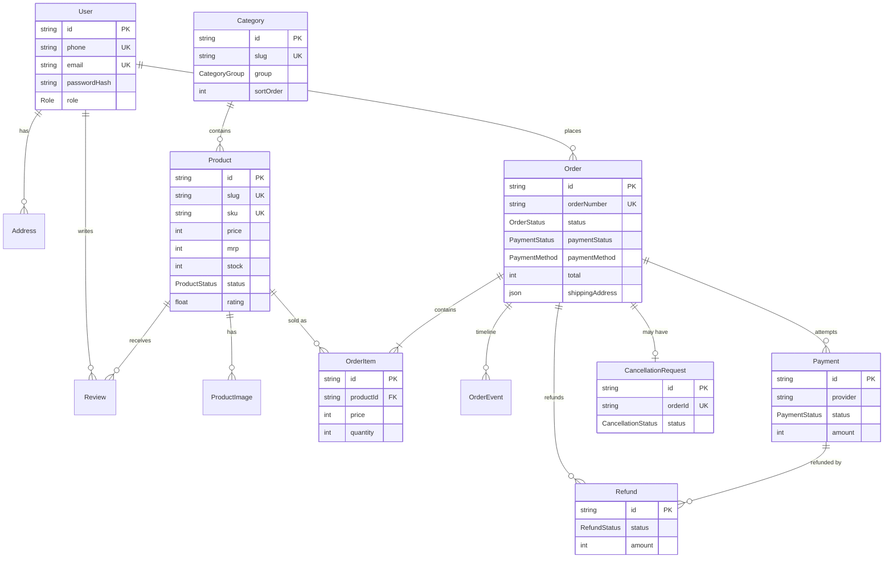

# Data model

The schema lives in [`prisma/schema.prisma`](../prisma/schema.prisma) (PostgreSQL 16, Prisma 7 with the
`prisma-client` generator; the client is generated into `src/generated/prisma`). This page describes every model and
enum, how they relate, and the conventions they follow.

- [Conventions](#conventions)
- [ER diagram](#er-diagram)
- [Enums](#enums)
- [Users & auth](#users--auth)
- [Catalogue](#catalogue)
- [Commerce](#commerce)
- [Store & marketing](#store--marketing)
- [Changing the schema](#changing-the-schema)

---

## Conventions

| Topic | Rule |
| --- | --- |
| **Money** | Whole Indian rupees as `Int` (₹1,299 is stored as `1299`). No paise, no floats. All prices are **GST-inclusive**. Display with `formatINR()` from `@/lib/format`. When integrating a gateway that expects paise, multiply by 100 at the boundary only. |
| **Totals** | Always computed by `calculateTotals()` in `@/lib/pricing`; the order row stores the result as a snapshot (`subtotal`, `discount`, `shippingFee`, `giftWrapFee`, `codFee`, `total`). |
| **GST** | Displayed at 18% inclusive on invoices (`GST_RATE`); the tax is extracted from the total, never added on top. |
| **IDs** | `cuid()` strings. Human-facing identifiers are separate unique columns (`Order.orderNumber`, `Product.sku`, `Product.slug`, `Coupon.code`). |
| **Snapshots** | Orders copy what they need at purchase time — item name/SKU/price/image in `OrderItem`, the address in `Order.shippingAddress` (JSON) — so later catalogue or address edits never change history. |
| **Timestamps** | `createdAt @default(now())`; mutable rows have `updatedAt @updatedAt`. |
| **Deletes** | Children of an order/product cascade (`onDelete: Cascade`). Links that must survive deletion use `SetNull` (e.g. `OrderItem.productId`, `Review.userId`, `Refund.paymentId`). Products with orders are archived rather than deleted. |
| **Arrays** | Tag-like metadata (`tags`, `skinTypes`, `concerns`, `occasions`, …) are Postgres `text[]`, filtered with `hasSome`. |

## ER diagram

Standalone tables (no relations): `OtpCode`, `Coupon` (linked to orders by `Order.couponCode`), `StoreSetting`,
`ContactMessage`, `NewsletterSubscriber`.

## Enums

| Enum | Values | Used by |
| --- | --- | --- |
| `Role` | `CUSTOMER`, `ADMIN` | `User.role` — admin panel access |
| `CategoryGroup` | `GIFTS`, `COSMETICS` | `Category.group` — powers `/gifts` and `/cosmetics` and cosmetic vs gift detail blocks |
| `ProductStatus` | `ACTIVE`, `DRAFT`, `ARCHIVED` | Only `ACTIVE` products appear on the storefront and in the sitemap |
| `ReviewStatus` | `PENDING`, `APPROVED`, `REJECTED` | New reviews are `PENDING` until moderated; only `APPROVED` ones count toward rating |
| `AddressType` | `HOME`, `WORK`, `OTHER` | Address label |
| `OrderStatus` | `PENDING_PAYMENT`, `CONFIRMED`, `PACKED`, `SHIPPED`, `OUT_FOR_DELIVERY`, `DELIVERED`, `CANCELLED` | Fulfilment state machine (see [ARCHITECTURE.md](ARCHITECTURE.md#5-order-state-machine)) |
| `PaymentStatus` | `PENDING`, `PAID`, `FAILED`, `REFUNDED` | `Order.paymentStatus` (summary) and `Payment.status` (per attempt) |
| `PaymentMethod` | `UPI`, `CARD`, `NETBANKING`, `WALLET`, `COD` | Chosen at checkout |
| `CancellationStatus` | `REQUESTED`, `APPROVED`, `REJECTED` | Customer cancellation requests |
| `RefundStatus` | `PENDING`, `PROCESSED`, `FAILED` | Refund processing |
| `CouponType` | `PERCENT`, `FLAT`, `FREE_SHIPPING` | How `Coupon.value` is interpreted |

Labels and badge tones for these enums live in `src/lib/order-status.ts`.

## Users & auth

### `User`
A customer or an admin.

| Field | Notes |
| --- | --- |
| `phone` (unique, optional) | 10-digit Indian mobile, no `+91`. Customers sign in with it via OTP. |
| `email` (unique, optional) | Used for invoices; admins sign in with email. |
| `passwordHash` | bcrypt hash — admins only. |
| `role` | `CUSTOMER` (default) or `ADMIN`. |
| Relations | `addresses`, `orders`, `reviews` |

### `OtpCode`
Mock OTP store. One row per OTP request: `identifier` (phone), `code`, `expiresAt` (10 minutes), `consumedAt` once used.
In demo mode `code` is always `123456` (`demoConfig.otp`). Indexed by `identifier`.

### `Address`
Saved delivery addresses of a user: `fullName`, `phone`, `line1`, `line2?`, `landmark?`, `city`, `state` (from
`INDIAN_STATES`), `pincode` (6 digits), `type`, `isDefault`. Deleted with the user. Orders copy the address, so
editing or deleting one never changes past orders.

## Catalogue

### `Category`
`slug` (unique, used in `/category/[slug]`), `name`, `tagline?`, `description?`, `group` (`GIFTS`/`COSMETICS`),
`image?`, `sortOrder`. Seeded categories include gift hampers, personalised gifts, home fragrance, festive gifts,
skincare, makeup, fragrance and bath & body.

### `Product`
The sellable item. Key field groups:

| Group | Fields |
| --- | --- |
| Identity | `slug` (unique), `sku` (unique), `name`, `shortDescription`, `description`, `categoryId` |
| Price & stock | `price` (selling, ₹), `mrp` (₹, ≥ price), `stock`, `lowStockAt` (default 5 — drives low-stock alerts) |
| Visibility | `status`, `isFeatured`, `isBestseller`, `isNew`, `tags[]` |
| Ratings | `rating` (average of approved reviews), `reviewCount` — recalculated on moderation |
| Gifting | `giftWrapAvailable`, `isPersonalizable`, `occasions[]`, `recipients[]`, `whatsInside[]`, `weightGrams?` |
| Cosmetics | `size`, `skinTypes[]`, `concerns[]`, `keyIngredients[]`, `ingredients` (full INCI), `howToUse`, `benefits[]`, `shade`, `isVegan`, `isCrueltyFree`, `isParabenFree`, `shelfLifeMonths` |
| Compliance (Legal Metrology) | `countryOfOrigin` (default "India"), `manufacturer`, `hsnCode` |
| SEO | `metaTitle?`, `metaDescription?` |

Indexed by `categoryId` and `status`.

### `ProductImage`
`url` (e.g. `/uploads/products/…` from the admin uploader), `alt`, `sortOrder` (first image is the card/thumbnail).
Cascades with the product.

### `Review`
`productId`, optional `userId` (set when a logged-in customer writes it), `authorName`, `city?`, `rating` (1–5),
`title`, `body`, `isVerified` (bought the product), `status` (`PENDING` → moderated). Indexed by
`[productId, status]`.

## Commerce

### `Coupon`
`code` (unique, uppercase), `description`, `type`, `value` (percent for `PERCENT`, rupees for `FLAT`, ignored for
`FREE_SHIPPING`), `minOrder`, `maxDiscount?` (cap for percent coupons), `usageLimit?`, `usedCount`, `startsAt?`,
`endsAt?`, `isActive`. Validated by `findValidCoupon()` in `src/server/orders.ts`. Seeded: `WELCOME10`, `FESTIVE500`,
`FREESHIP`, `GIFTING15`, plus an expired (`MONSOON20`) and an inactive (`STAFF25`) coupon.

### `Order`
One checkout.

| Group | Fields |
| --- | --- |
| Identity | `orderNumber` (unique, `LA` + `YYMMDD` + 4 digits), `userId` |
| State | `status` (`OrderStatus`, default `PENDING_PAYMENT`), `paymentStatus`, `paymentMethod` |
| Money snapshot (₹) | `mrpTotal`, `subtotal`, `discount` (coupon), `shippingFee`, `giftWrapFee`, `codFee`, `total`, `couponCode?` |
| Gifting | `giftWrap`, `giftMessage?` (≤ 200 characters) |
| Delivery | `shippingAddress` (JSON snapshot matching the `ShippingAddress` type), `email?`, `phone` |
| Tracking | `courier?`, `trackingNumber?` (AWB), `estimatedDelivery?` |
| Relations | `items`, `events`, `payments`, `refunds`, `cancellation` |

Indexed by `userId`, `status`, `createdAt`. **Never update `status` directly** — use the functions in
`src/server/orders.ts`.

### `OrderItem`
Line snapshot: `productId?` (nullable if the product is later deleted), `name`, `sku`, `image?`, `price`, `mrp`,
`quantity`.

### `OrderEvent`
Timeline entry: `status?` (set when the event is a status change), `title`, `note?`, `location?` (for courier scans),
`createdAt`. Shown on the customer order page, `/track` and admin order detail.

### `Payment`
One payment attempt: `provider` (default `RAZORPAY_DEMO`), `providerPaymentId?` (e.g. `pay_demo_…`), `method`,
`amount`, `status`, `failureReason?`. A failed attempt stays in the ledger and a new `PENDING` attempt is created for
the retry. COD orders get a `PENDING` payment that becomes `PAID` on delivery.

### `CancellationRequest`
At most one per order (`orderId` unique): `reason` (from `CANCELLATION_REASONS`), `comment?`, `status`, `adminNote?`,
`resolvedAt?`. Unpaid orders are auto-approved.

### `Refund`
Created automatically when a paid order is cancelled: `orderId`, `paymentId?`, `amount`, `reason`, `status`,
`reference?` (e.g. `rfnd_demo_…` once processed), `processedAt?`. Indexed by `status` for the admin refunds queue.

## Store & marketing

### `StoreSetting`
Single row with `id = "store"`, editable in Admin → Settings: `storeName`, `supportEmail`, `supportPhone`,
`whatsappNumber?`, `gstin?`, `registeredAddress`, `freeShippingThreshold` (₹999), `shippingFee` (₹79), `codFee` (₹49),
`codEnabled`, `giftWrapFee` (₹59), `announcement?` (announcement bar text). Read via `getStoreSettings()`, which falls
back to the same defaults if the row is missing.

### `ContactMessage`
Messages from `/contact`: `name`, `email`, `phone?`, `subject` (Order help, Corporate gifting, Product question,
Returns, Other), `message`, `createdAt`.

### `NewsletterSubscriber`
`email` (unique) from the footer sign-up form.

## Changing the schema

1. Edit `prisma/schema.prisma`.
2. `npm run db:migrate -- --name describe_change` (creates a migration and regenerates the client).
3. Update the seed in `prisma/seed.ts` / `prisma/seed/*` if needed, and `npm run db:reset` to verify from scratch.
4. In production, apply with `npx prisma migrate deploy`.
